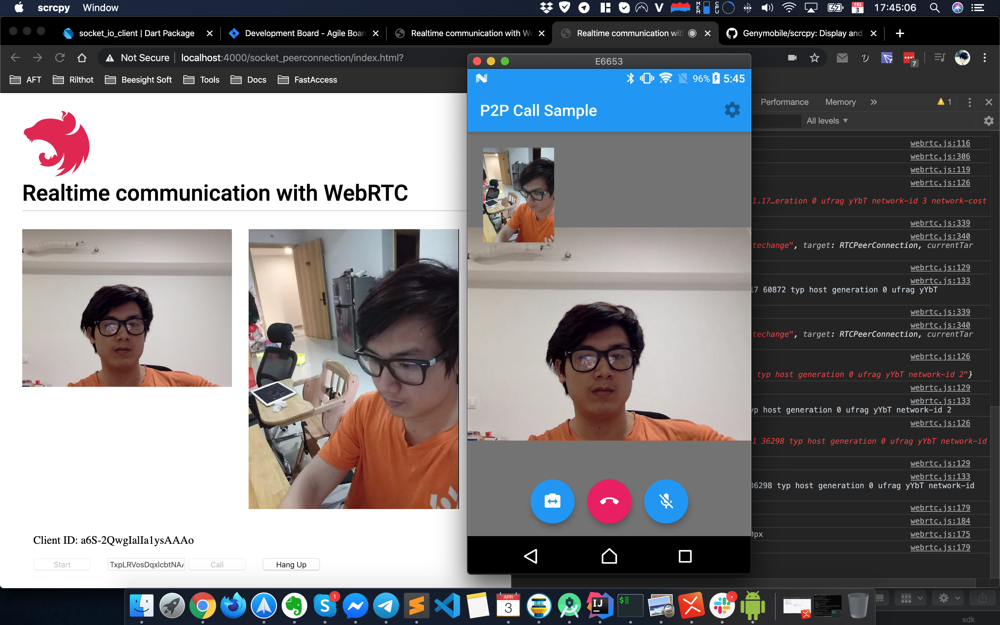

# Flutter WebRTC Example



# Install

- NodeJs: https://nodejs.org/en/download/
- NestJs: https://docs.nestjs.com/first-steps
- Flutter: https://flutter.dev/docs/get-started/install
- Local https server: https://www.npmjs.com/package/local-web-server

# Runing

## Start webrtc server first

```
cd webrtc-nestjs-server
npm i
npm start
```

## Test with web webrtc client

```
cd webrtc-web-client
ws --http2 
```

## Test with Flutter webrtc client

```
cd webrtc-flutter-client
flutter run
```


